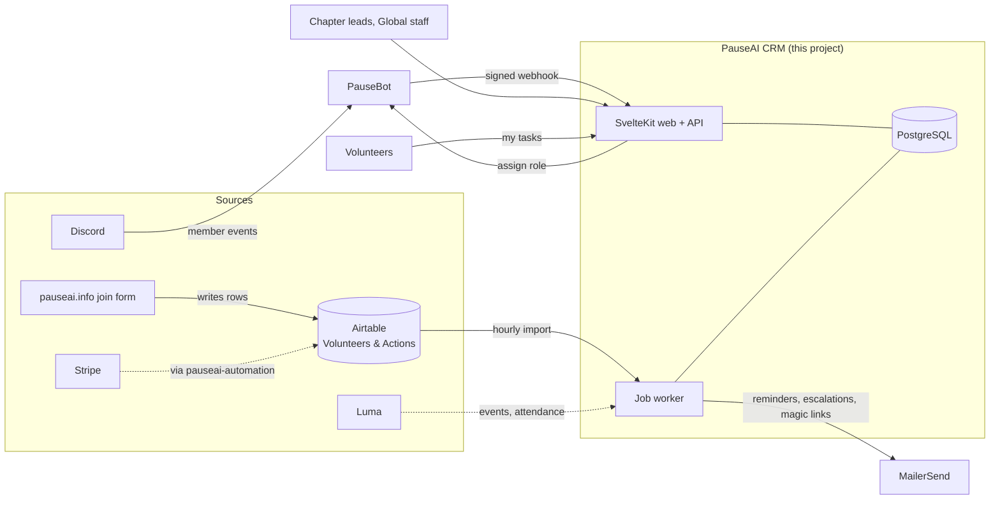

# Architecture

## Goals

From the brief (Joep, PauseAI Global) and the PauseAI UK notes:

1. **One database of everyone**: volunteers, politicians, journalists, donors and partners, with every action they took, every message we sent them and everything they said to or about us.
2. **Usable by all chapters, managed by Global**: national chapters and local groups see and manage their own people; PauseAI Global sees everything and sets the rules.
3. **Integrates with what exists**: Airtable (where signups land today), Discord (via PauseBot), plus MailerSend, Luma, Stripe, Substack, WhatsApp.
4. **Volunteer hand-holding**: every volunteer always has a clear next step; templates for events that are known to work; deadlines that remind and escalate.
5. **Do not get hacked**: small attack surface, least privilege, PII only where needed.
6. **Good software**: documented, tested, cheap to run, pleasant to use.

## Non-goals (for now)

- Replacing Airtable as the *write* target of the website join form. Airtable stays the system of record for signups until the CRM has proven itself; the CRM mirrors it (see [integrations.md](integrations.md)).
- Being a general-purpose email marketing tool. Campaign email is on the roadmap; the first releases focus on data, access and tasks.
- Web scraping people. It is legally fraught under GDPR and out of scope until there is a documented lawful basis.

## The system in one picture

Solid arrows exist today; dotted ones are designed but not built.

## Shape: a modular monolith

Two processes from one codebase, sharing one PostgreSQL database:

- **web**: SvelteKit (Svelte 5) serving the UI and the HTTP API, including inbound webhooks. Node adapter, one container.
- **worker**: `pnpm worker`, runs the job queue (`jobs` table, `for update skip locked`) and the recurring schedule. One instance is enough; several are safe.

No Redis, no message broker, no serverless functions. The queue is a table. This keeps hosting to "one small container plus a managed Postgres", roughly the cost of a coffee a month on Railway, Fly or Hetzner, and makes local development a `pnpm db:local` away.

### Why SvelteKit and TypeScript

The PauseAI website team already works in SvelteKit and TypeScript, and `pauseai-automation` is TypeScript too. The server modules under `src/lib/server` deliberately do not import SvelteKit, so they run from the worker and from scripts, and could be lifted into another framework if the team ever moved.

### Why PostgreSQL

Row-level scoping by chapter subtree, partial unique indexes for idempotent syncs, JSONB for template steps and metadata, and `skip locked` for the queue. Managed Postgres is available everywhere PauseAI already hosts things. See [decisions/0001](decisions/0001-build-on-postgres-not-airtable-or-atomicserver.md) for the alternatives considered.

## Modules

| Module | Responsibility |
| --- | --- |
| `db/schema.ts` | The whole data model, documented inline. `pnpm db:generate` turns edits into SQL migrations. |
| `chapters.ts` | The Global → national → local tree, materialized paths, routing a signup to the right chapter (country, then nearest local group). |
| `people.ts` | Find-or-create with identity resolution, consent history, interaction log, memberships. Every write is idempotent. |
| `auth/` | Passwordless sign-in by email. Tokens and session ids stored hashed. |
| `authz/` | Builds an `Actor` per request; SQL predicates for "people this actor may see"; field masking by tier. |
| `tasks/` | Project templates → tasks with relative deadlines; reminders before and escalation after a missed deadline. |
| `jobs/` | The queue, backoff, dedupe keys, the recurring schedule. |
| `sync/airtable.ts` | Incremental import of Members and National groups, with a drift report for unknown vocabulary values. |
| `integrations/discord` | Verifies PauseBot's signed events, links Discord identities, maps country roles to chapters. |
| `integrations/mailersend` | The one door for outbound email, sandboxed by default. |

## Request lifecycle

1. `hooks.server.ts` reads the session cookie, loads the person and builds the `Actor` (grants resolved to chapter paths and team ids).
2. Route `load` functions call `requireActor`, `requireStaff` or `requireGlobalAdmin`, then query through the `authz` helpers, never the raw tables for people.
3. Mutations are SvelteKit form actions, so they work without JavaScript and get CSRF protection for free.
4. Anything slow or external (Airtable, email) is enqueued, not awaited in the request.

## Deployment

- One container image (`pnpm build` → `node build`), one worker process (`pnpm worker`), one Postgres. Railway is the obvious host because PauseBot already runs there and it has push-to-deploy plus managed Postgres with backups; Fly or a Hetzner VM work just as well.
- Secrets via environment variables only (`.env.example` lists them). Nothing secret is committed, and the sync asks Airtable for an explicit field list so PII we do not need never enters the process.
- Health check at `/api/health`.
- Backups: the managed database's daily snapshot, plus `pg_dump` to object storage weekly once there is real data.

## Observability

Structured `console` logging for now (Railway and Fly capture it). The admin page shows sync state, recent jobs with errors, recent webhook events and the sandbox outbox. Sentry is a one-line addition when the team wants it; the website already uses it.

## Testing

`pnpm test` runs Vitest against a real PostgreSQL 16 so that partial indexes, `skip locked` and enum casts are exercised, not mocked. Each test file truncates the tables it touches. External APIs (Airtable, MailerSend) are exercised through injected `fetch` implementations, so tests need no network and no secrets.
