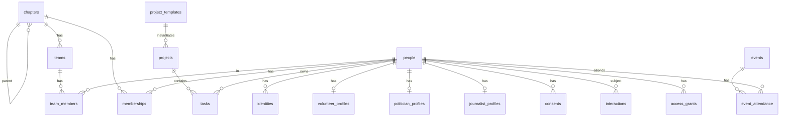

# Data model

The schema is in `src/lib/server/db/schema.ts`, with a comment on every non-obvious column. This page explains the shape and the reasoning.

## People: one table for every human

`people` holds the shared core (name, email, phone, location, languages) and a `kinds` array saying which hats a person wears: `volunteer`, `subscriber`, `politician`, `journalist`, `donor`, `partner`. Role-specific data lives in profile tables:

- `volunteer_profiles`: what the join form asked (intent, hours, skills, motivations, how they found us), plus a lifecycle `stage` (`joined → onboarding → active → highly_active → dormant → churned`).
- `politician_profiles`: level, body, party, constituency, stance, surgery info, a parliament id for Hansard lookups.
- `journalist_profiles`: outlet, beat, region, stance.

One table for everyone means one timeline, one deduplication rule and one place to honour a deletion request. A journalist who is also a volunteer is one row with two profiles.

`email` is unique when present and always lower-cased; it may be null because we often add a politician before we have an address. A sync never overwrites an existing email with a different one: that is a merge, and merges are a human decision.

## Identities: how external systems point at a person

`identities(provider, external_id)` links a person to their Discord id, Airtable record, Stripe customer, Luma guest, phone number, and so on. Syncs resolve people through identities first, so re-running a sync is harmless and renaming someone in one system does not create a duplicate in ours.

A username someone typed into a form is a *claim*, not a verified identity. The Airtable import stores it as `discord:username:<name>` with no `verified_at`; when PauseBot reports that username joining the server, the handler swaps the claim for the real snowflake id and marks it verified. The person page shows the difference.

## Chapters: a tree with a path

`chapters` is Global at the root, national chapters below it, local groups below those. `path` is the materialized chain of slugs (`/global/pauseai-uk/bristol`), so:

- "everyone under PauseAI UK" is `path like '/global/pauseai-uk/%'`;
- an access grant on a chapter automatically covers every group beneath it;
- splitting a group that grew too big is: create two children, move memberships, mark the parent inactive. The UK note about redrawing local boundaries is a data operation, not a schema change.

Chapters carry the hooks into other systems: `discord_role_id`, `discord_channel_id`, `whatsapp_url`, `airtable_record_id`, and a centre point for distance-based routing.

`memberships` is the person ⇄ chapter link with a movement role (`member`, `volunteer`, `team_lead`, `chapter_lead`), a status, and a `source` so a Discord-derived membership can be closed when someone leaves the server without touching one that came from the join form.

`teams` are working groups inside a chapter (media, events, the weekly call). Team membership is separate from access: being on a team does not by itself grant system access, but leading one does grant scoped visibility of its members.

## Access grants versus movement roles

Two different things, kept apart on purpose:

- `memberships.role` says what someone *is* in the movement.
- `access_grants` says what someone may *see and do* in the CRM: `global_admin` (everything), `chapter_admin` scoped to a chapter subtree, `team_lead` scoped to a team, `volunteer` (own record and tasks).

Discord roles are never read as authorization. They are an identity signal and a channel. See [permissions-and-security.md](permissions-and-security.md).

## Consents: append-only

Every consent decision is a row: purpose (`privacy_policy`, `newsletter`, `chapter_share`, `volunteer_agreement`, `code_of_conduct`, `sms`, `whatsapp`), granted or not, source, evidence. The latest row wins; the history is the audit trail GDPR asks for. Critical-mobilisation email is a legitimate-interest basis, not a consent, and so is deliberately not a purpose here (matching the website's 2026-06-10 decision).

## Interactions: one timeline

`interactions` records everything that happened with a person: emails we sent or received, DMs, calls, meetings, events registered or attended, actions completed, tasks done, statements in parliament, press mentions, donations. `external_ref` makes imports idempotent (`mailersend:<id>`, `discord:join:<id>:<time>`). `visibility` (`team`, `leads`, `admins`) lets a lead write a note that a fellow volunteer will not see.

## Work: templates, projects, tasks

`project_templates.steps` is JSON: a list of `{ key, title, description, dueOffsetDays, dueRelativeTo, defaultOwner, actionKind }`. Instantiating a template for a chapter creates a `project` and one `task` per step with a concrete `due_at`. The built-in templates in `tasks/templates.ts` are the "event in a box" the UK notes ask for; chapters can add their own in the database.

Tasks carry an owner, an optional team, an `escalation_level` and `reminded_at`. The hourly sweep reminds owners two days before a deadline and, two days after a missed one with no update since the reminder, hands the task to the project owner, then the nearest chapter admin, then a global admin, telling both people. `idle_volunteers(chapter)` lists active members with no open task, which is the query behind "everyone always has a next step".

## Plumbing

- `sessions`, `login_tokens`: hashed, expiring.
- `jobs`: the queue. `dedupe_key` is unique while a job is queued or running, so the scheduler can be called from several processes.
- `sync_sources`: cursor and last-run stats per import.
- `webhook_events`: every inbound event, stored before it is processed, unique per source and event id.
- `audit_log`: who changed what (populated by the write paths as they are added to the UI).

## What is deliberately not modelled yet

- Email campaigns, segments and templates: designed around `consents` and `memberships`, see the roadmap.
- Organisations (coalition partners, outlets) as first-class rows; `journalist_profiles.outlet` is a string until there is a need to link people to organisations.
- Geocoding of people. `latitude`/`longitude` exist on both people and chapters; filling them needs a geocoder and a privacy decision (postcode-level only).
