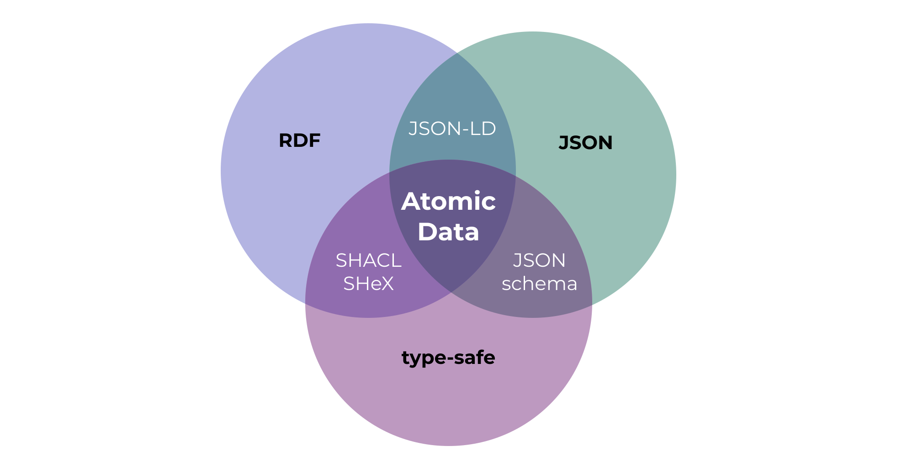

{{#title Atomic Data}}

**Atomic Data is a modular specification for sharing, modifying and modeling graph data. It combines the ease of use of JSON, the connectivity of RDF (linked data) and the reliability of type-safety.**

Atomic Data uses links to connect pieces of data, and therefore makes it easier to connect datasets to each other - even when these datasets exist on separate machines.
Resources are addressed with portable [`did:ad` identifiers](did.md), edited with signed [CRDT commits](commits/intro.md), and can live [entirely local-first](atomicserver/local-first.md) before syncing to peers.

## AtomicServer

[AtomicServer](atomic-server.md) is an open source, powerful graph database + headless CMS.
It's the reference implementation for the Atomic Data specification, written in Rust.

## Atomic Data Core

Atomic Data has been designed with [the following goals in mind](motivation.md):

- Give people more control over their data
- Make linked data easier to use
- Make it easier for developers to build highly interoperable apps
- Make standardization easier and cheaper

Atomic Data is [Linked Data](https://ontola.io/blog/what-is-linked-data/), as it is a [strict subset of RDF](interoperability/rdf.md).
It is type-safe (you know if something is a `string`, `number`, `date`, `URL`, etc.) and extensible through [Atomic Schema](schema/intro.md), which means that you can re-use or define your own Classes, Properties and Datatypes.

The default serialization format for Atomic Data is [JSON-AD](core/json-ad.md), which is simply JSON where each key is a URL of an Atomic Property.
These Properties are responsible for setting the `datatype` (to ensure type-safety) and setting `shortnames` (which help to keep names short, for example in JSON serialization) and `descriptions` (which provide semantic explanations of what a property should be used for).

[Read more about Atomic Data Core](core/concepts.md)

## Atomic Data Extended

Atomic Data Extended is a set of extra modules (on top of Atomic Data Core) that deal with data that changes over time, authentication, and authorization.

{{#include extended-table.md}}

## Tools & libraries

- Web app (data-browser) in the [`atomic-server` monorepo](https://github.com/atomicdata-dev/atomic-server/tree/master/browser) ([demo on atomicdata.dev](https://atomicdata.dev))
- Typescript libraries: [`@tomic/lib`](js.md), [`@tomic/react`](usecases/react.md), [`@tomic/svelte`](svelte.md)
- Host your own [atomic-server](https://github.com/atomicdata-dev/atomic-server) (powers [atomicdata.dev](https://atomicdata.dev), run with `docker run -p 80:80 -v atomic-storage:/atomic-storage joepmeneer/atomic-server`)
- Command line tool: [atomic-cli](https://github.com/atomicdata-dev/atomic-server) (`cargo install atomic-cli`)
- Rust library: [atomic-lib](https://github.com/atomicdata-dev/atomic-server)

## Get involved

Make sure to [join our Discord](https://discord.gg/a72Rv2P) if you'd like to discuss Atomic Data with others.

## Status

Keep in mind that none of the Atomic Data projects has reached a v1, which means that breaking changes can happen.
The 0.41 line is the local-first / `did:ad` release — see the [roadmap](roadmap.md) and [changelog](https://github.com/atomicdata-dev/atomic-server/blob/develop/CHANGELOG.md).

## Reading these docs

This is written mostly as a book, so reading it in the order of the Table of Contents will probably give you the best experience.
That being said, feel free to jump around - links are often used to refer to earlier discussed concepts.
If you encounter any issues while reading, please leave an [issue on Github](https://github.com/atomicdata-dev/atomic-server/issues).
Use the arrows on the side / bottom to go to the next page.

{{#include SUMMARY.md}}
